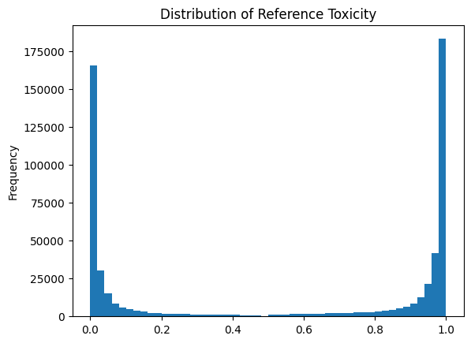

# Introduction
Detecting and rewriting toxic texts is an important NLP task due to the increasing need to maintain healthy interactions in digital communication spaces. The proliferation of online platforms where users interact through text has given rise to the urgent necessity of moderating content to ensure it adheres to community guidelines and preserves the well-being of users. Toxic text can encompass a range of negative behaviors including harassment, hate speech, and general negativity, which can have profound effects on individuals and communities. Therefore, developing robust methods to identify and neutralize such content is critical in fostering positive online environments.

# Data analysis
Given dataset is a subset of the ParaNMT corpus (50M sentence pairs).
1. Dataset contains 6 features: `reference`, `translation`, `similarity`, `length_diff`, `ref_tox`, `trn_tox`, but only 4 of them is useful for our task: `reference`, `translation`, `ref_tox`, `trn_tox`.
2. Dataset contains approx. half of the reverse examples, so it shoud ve reverted during the preprocessing, or deleted.
    
3. Average reference length is 50-60. It is possible observe >300 symbols in reference, because lack of examples of them.

# Data preprocessing
Two columns, 'similarity' and 'length_diff', are removed from the DataFrame. There is a condition set to identify rows where the toxicity score of the translation (trn_tox) is higher than the toxicity score of the reference (ref_tox). For these rows, the 'reference' and 'translation' columns are swapped, as well as their corresponding toxicity scores ('ref_tox' and 'trn_tox'). This effectively corrects the ordering such that the reference always has a higher toxicity score than the translation. The DataFrame is further filtered to keep only the rows where the reference toxicity score is greater than 0.8 and the translation toxicity score is less than 0.1. This step narrows down the dataset to examples with a high toxicity disparity. An additional filter is applied to retain only the rows where the 'reference' string length is greater than 30 and the 'translation' string length is greater than 20 characters. This ensures that both the reference and translation texts have a minimum length, potentially to maintain a certain level of contextual integrity.

# Model Specification
The best performance was obtaied from fine-tuned for our data pre-trained T5 model for paraphrasing [humarin/chatgpt_paraphraser_on_T5_base](https://huggingface.co/humarin/chatgpt_paraphraser_on_T5_base). This model is based on the T5-base model. We used "transfer learning" to get our model to generate paraphrases as well as ChatGPT. Now developers say that this is one of the best paraphrases of the Hugging Face.

The T5, or Text-to-Text Transfer Transformer[3], model represents a unified approach to NLP tasks proposed by researchers at Google in 2019. Unlike traditional models that are designed for specific tasks like translation, summarization, or classification, T5 reframes all NLP tasks into a text-to-text format where the input and output are always strings of text. This framework simplifies the process of applying a model to a wide array of tasks without significant task-specific modifications. T5 was pre-trained on a large corpus using a variation of the masked language modeling objective, similar to BERT, called "span corruption," where contiguous sequences of text were replaced with a sentinel token and the model was trained to predict the missing spans.

# Training Process
The model was trained for 4 epochs on the entire training set. Dev validation was used for eveluationg the BLEU score of the model.

# Evaluation
For the evaluation of all methods was used the special metric, taht includes:
* *style transfer accuracy* (**STA**): percentage of nontoxic outputs identified by a style classifier
* *content preservation* (**SIM**): cosine similarity between the embeddings of the original text and the output computed with the model and BLEU
* *fluency* (**FL**): percentage of fluent sentences identified by a RoBERTa-based classifier of linguistic acceptability trained on the CoLA dataset

Concider each one in more details.

### Style transfer accuracy
Softmax of the [s-nlp/roberta_toxicity_classifier](https://huggingface.co/s-nlp/roberta_toxicity_classifier) model. This model was prevoiusly checked on MSE with target toxixities of our dataset, and gets ~0.03. So it is suitable for us. For the evaluation we must revert it ($1-S$)

### Content preservation
For this metric `sentence-bleu` from the `nltk` library was used, and flair embeddings similarity. After its calculations we get the mean between the outputs.

### Fluency
[textattack/roberta-base-CoLA](https://huggingface.co/textattack/roberta-base-CoLA) was used for this metric in a similar with STA way (using the softmax). This model has the biggest number of downloads on Hugging Face, and it used by many spaces for checking the grammar and other linguistic stuff.

The final score is evaluating by $E = STA \cdot SIM \cdot FL$

# Results
The fine-tuned T5 model demonstrated notable proficiency in detoxifying and paraphrasing text, according to the metric our model gets ~0.45, that means it is better than other provided methods.
