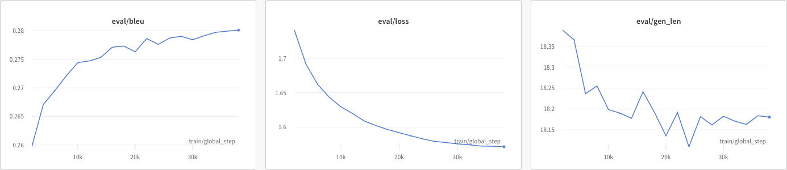

# Solution Building Report
## Baseline methods
### Baseline 1: Dictionary based
The simplest method for the task uses a dictionary-based approach to classify text inputs. The system scans the text for a list of predefined toxic words and phrases, and if any of them are found, it change it to neutral or positive alternative.

This method is fast and easy to implement, but lacks nuance and does not account for context well, resulting in a low metric level.

### Baseline 2: Conditional BERT mask-filling
Conditional BERT model (CondBERT)[2] is one of the simplest AI method for this task. It check the text on predefined dictionary, but we do not need to have the neutral pair in this dict. We mask this word, and use BERT-like model for the mask-filling.

Using this method will improve the accuracy of detoxification by incorporating context into the decision-making process. CondBERT can leverage pre-existing knowledge from a large corpus of text, making it more adept at understanding nuances and language patterns.

In this work I do not have a purpose to test the baseline methods. So I tried to make this practical study LM oriented.

## (L)LM methods
The Transformer Architecture [1] has improved the state-of-the-art in various sequence modeling tasks. Transformer-based Large Language Models (LLM), have displayed near-human or sometimes even superhuman performance on specific tasks. The capability to process and generate coherent and contextually relevant text has led to their widespread adoption.

One of the significant advantages of LLMs is their flexibility. They can perform a variety of tasks without task-specific training, a characteristic known as zero-shot learning. However, to enhance their performance or tailor them to specific applications, techniques like few-shot learning and fine-tuning are employed.

### Hypothesis 1: Few-shot
I've chosen two language models for this hypothesis: [t5-large](https://huggingface.co/t5-large) and [Mistral](https://huggingface.co/mistralai/Mistral-7B-v0.1). T5-large is relatively small in the broader landscape of LMs, offering a balanced approach to text-to-text tasks, especially when fine-tuned for specific domains. In contrast, Mistral stands as a state-of-the-art model, an advanced LM designed for complex tasks. It boasts enhanced context understanding and can generate detailed text with high accuracy. Mistral is ideal for few-shot learning, capable of adapting to new tasks with minimal examples.

#### Hypothesis 1.1: T5 is good but not ideal for few-shoting
First, I attempted to few-shot the T5 model by providing a limited number of examples from which it was supposed to learn and then evaluate its capacity to generalize this knowledge to accomplish a specific task. Unfortunately, this approach was unsuccessful. The model either generated text that was identical to the input or produced variations that contained toxic elements. 

This outcome indicates that the T5 model, is not suitable for the few-shot, because of this size and architecture.

#### Hypothesis 1.2: Mistral will work with few-shot
Then I tried to few-shot the Mistral model. At a glance it worked and give the acceplatble results. I palyed with number of shot and generation config of the model lookinmg for some examples. After that I evaluate 50 samples using the metric (see Final Solution Report). In average the metric was ~0.2 and it is good result for the model without training.

In conclusion about this method, Mistral is good model for few-shoting, it demonstrates its ability to quickly adapt and perform tasks without extensive prior training, but it required difficult prompt tunung to improve metrics, and required many computational resources.

## Hypothesis 2: T5 fine-tunes well
I take pre-trained T5 model for paraphrasing [humarin/chatgpt_paraphraser_on_T5_base](https://huggingface.co/humarin/chatgpt_paraphraser_on_T5_base), and fine tune it on the train set. The training 3 epochs took 2 hours on the RTX A5000.

According to the metric it is the best method for this task, it gets ~0.45. This model is smaller than `t5-large`, and could be inferenced in any CPU and GPU.

## Results
In this assignment, we explored various methods to detoxify text input using Large Language Models (LLMs) and established baselines. We experimented with few-shot learning approaches using T5 and Mistral models. The T5-large model, despite its promise, did not perform well in few-shot learning scenarios, generating responses that were either too similar to the input or still contained toxic elements. Conversely, the Mistral model displayed considerable potential in few-shot settings. The most effective approach was fine-tuning a pre-trained T5 model on a paraphrasing task, suggesting that fine-tuning LLMs on specific tasks with appropriate datasets could lead to substantial improvements in performance for detoxification tasks.